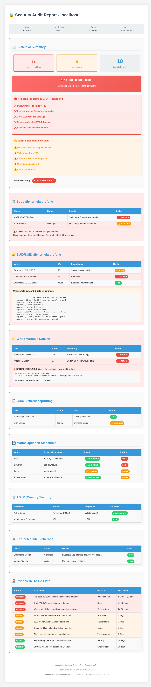

# 🔒 Ansible Security Audit Framework

**Enterprise-Grade Security Compliance Automation für Linux-Systeme**
Automatisiert manuelle Sicherheitsaudits in reproduzierbare, revisionssichere und skalierbare Prozesse.

---

## 🎯 Executive Overview

### Herausforderung

Klassische Linux-Sicherheitsaudits sind oft:

* manuell und zeitintensiv
* inkonsistent zwischen Systemen
* schlecht dokumentiert
* schwer nachvollziehbar für Auditoren

### Lösung

Das **Ansible Security Audit Framework** bietet eine produktionsreife Plattform zur **vollständigen Automatisierung von Linux-Sicherheitsaudits**:

* ✅ 18+ sicherheitsrelevante Prüfungen in wenigen Minuten
* ✅ Klare, einheitliche Risikoklassifizierung
* ✅ Automatisch generierte HTML-Berichte
* ✅ Ausrichtung an CIS-Benchmarks und Best Practices
* ✅ Deutliche Reduktion von Audit- und Behebungszeiten

---

## 🚦 Risikolegende (Ampelsystem)

Zur Vermeidung von Darstellungsproblemen (z. B. Dark Mode, PDF-Exporte) werden **Farbe und Text immer kombiniert**:

* 🔴 **KRITISCH (Rot)** – Sofortige Aktion erforderlich (0–24 Stunden)
* 🟠 **MITTEL (Orange)** – Innerhalb von 7 Tagen beheben
* 🟢 **NIEDRIG (Grün)** – Für nächsten Wartungszeitraum planen

---

## 🧠 Intelligente Risikobewertung

### 🔴 KRITISCH (Rot)

Akut ausnutzbare Schwachstellen oder direkte Privilegieneskalation:

* NOPASSWD sudo-Einträge
* World-writable Systemdateien
* Deaktivierter ASLR-Schutz
* Offener SSH-Root-Login

### 🟠 MITTEL (Orange)

Sicherheitsrelevante Abweichungen ohne unmittelbaren Exploit:

* Fehlende Sicherheitspakete
* Unsichere Mount-Optionen
* Unnötige Kernel-Module
* Veraltete oder schwache Passwortrichtlinien

### 🟢 NIEDRIG (Grün)

Keine akute Gefährdung, Fokus auf Härtung und Optimierung:

* Informatorische Funde
* Best-Practice- und Härtungsempfehlungen

---

## 🔍 Sicherheitsdomänen & Prüfungen

### 🔐 Authentifizierung & Zugriff (CIS 5.x)

| Prüfung             | Beschreibung                  | Risiko      | CIS    |
| ------------------- | ----------------------------- | ----------- | ------ |
| Passwortrichtlinien | Länge, Ablauf, Komplexität    | 🔴 Kritisch | 5.4.1  |
| SSH-Härtung         | Root-Login, Auth-Methoden     | 🔴 Kritisch | 5.2.8  |
| Sudo-Konfiguration  | NOPASSWD, Wildcards           | 🔴 Kritisch | 5.3.1  |
| SUID/SGID-Dateien   | Privilege-Escalation-Vektoren | 🟠 Mittel   | 6.1.10 |

### 🛡️ Systemhärtung (CIS 1.x, 6.x)

| Prüfung             | Beschreibung                   | Risiko      | CIS   |
| ------------------- | ------------------------------ | ----------- | ----- |
| ASLR-Status         | Kernel-Speicher-Randomisierung | 🔴 Kritisch | 1.5.3 |
| Kernel-Module       | Unnötige / gefährliche Module  | 🟠 Mittel   | 1.1.1 |
| Mount-Optionen      | noexec / nosuid / nodev        | 🟠 Mittel   | 1.1.2 |
| Dateiberechtigungen | World-writable Dateien         | 🔴 Kritisch | 6.1.2 |

### 🌐 Netzwerksicherheit (CIS 3.x)

| Prüfung         | Beschreibung               | Risiko      | CIS   |
| --------------- | -------------------------- | ----------- | ----- |
| Firewall-Status | UFW aktiv / korrekt        | 🔴 Kritisch | 3.5.1 |
| Offene Ports    | Lauschen unnötiger Dienste | 🔴 Kritisch | 3.1.1 |
| Services        | Unsichere Defaults         | 🟠 Mittel   | 3.2.1 |

### 📋 Monitoring & Compliance (CIS 4.x)

| Prüfung           | Beschreibung          | Risiko      | CIS   |
| ----------------- | --------------------- | ----------- | ----- |
| Auditd            | System-Auditing aktiv | 🟠 Mittel   | 4.1.1 |
| SELinux           | Enforcing-Status      | 🟠 Mittel   | 1.6.1 |
| Sicherheitspakete | fail2ban, Updates     | 🟢 Niedrig  | 1.8.1 |
| Cron-Jobs         | Verdächtige Tasks     | 🔴 Kritisch | 5.1.1 |

---

## 🚀 Schnellstart

### Voraussetzungen

```bash
ansible --version   # >= 2.9
```

### Installation

```bash
git clone https://github.com/yourusername/ansible-security-audit.git
cd ansible-security-audit
./create_local_security_audit.sh my-security-audit
```

### Audit ausführen

```bash
cd my-security-audit
ansible-playbook -i inventory site.yml
xdg-open /bigdata/tmp/ansible-security-audit/security_report_localhost.html
```

---

## 📊 Reporting & Mehrwert

Das Framework erzeugt automatisch **strukturierte HTML-Berichte** mit:

* Executive Summary
* Ampelbasierter Risikobewertung
* Technischen Nachweisen
* CIS-Mapping
* Priorisiertem Maßnahmenplan (24h / 7 Tage / planbar)

---

## 🧱 Projektstruktur

```
ansible-security-audit/
├── create_local_security_audit.sh
├── README.md
├── LICENSE
├── generated-project/
│   ├── site.yml
│   ├── inventory
│   ├── vars/main.yml
│   └── roles/
│       ├── password_policy/
│       ├── ssh_hardening/
│       ├── sudo_check/
│       ├── firewall_check/
│       ├── kernel_security/
│       └── report/
└── reports/
```

---

## 🤝 Rollen & Zusammenarbeit

| Rolle               | Nutzung                       |
| ------------------- | ----------------------------- |
| Security Officer    | Richtlinien & Risikoüberblick |
| Systemadministrator | Technische Behebung           |
| DevOps              | CI/CD-Integration             |
| Auditor             | Compliance-Nachweise          |
| Management          | KPIs & Executive Summary      |

---

## Beispiel: Security Audit Report



---

## 📜 Lizenz & Sicherheit

* **Lizenz:** MIT
* Keine Telemetrie, keine externen Abhängigkeiten
* Lokale Ausführung
* Transparenter, auditierbarer Code

---

> 🔐 *Automatisieren Sie Linux-Sicherheitsaudits – klar priorisiert, nachvollziehbar und skalierbar.*
